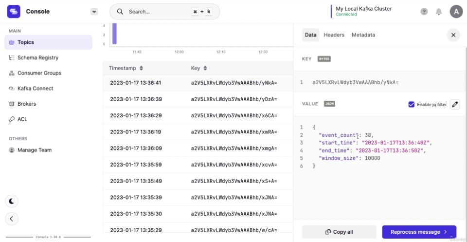

# Kafka Streams Template with Spring Boot

[](https://openjdk.org/projects/jdk/17/)
[](https://kafka.apache.org/documentation/streams/)
[](LICENSE)

A professional Kafka Streams template to build event-driven microservices and real-time data pipelines.

---

## ✨ Features

✅ Kafka Streams app with plug-and-play processors  
✅ Field-based windowed counting (per field value)  
✅ Generic counting processor  
✅ Event counting per time window  
✅ Clean folder structure & modular design  
✅ Easy to extend and customize  
✅ Ready to use in production microservices  

---

## 🧠 Included Processors

| Processor Class              | Description                                                  |
|-----------------------------|--------------------------------------------------------------|
| `KafkaStreamsApp`             | Main class — builds and runs the Kafka Streams topology       |
| `GenericCountStreamBuilder`   | Generic counting of value types                              |
| `FieldCountTimeseriesBuilder` | Field-based windowed counting (e.g. `server_name`)           |
| `EventCountTimeseriesBuilder` | Event counting per time window and group key                |

---

## 🧰 Tech Stack

- Java 17  
- Apache Kafka  
- Kafka Streams API  
- Gradle  
- Docker Compose  

---

## How to Use
1. Clone repo
2. Start Kafka with Docker or local install
3. `mvn clean package`
4. Run:
   ```bash
   java -cp target/demo.jar com.example.ProducerApp
   java -cp target/demo.jar com.example.ConsumerApp

## 📸 Demo

Kafka Streams application in action:

### 🔁 Real-Time Stream Processing  
Displays how messages flow through your Kafka Streams topology.  

